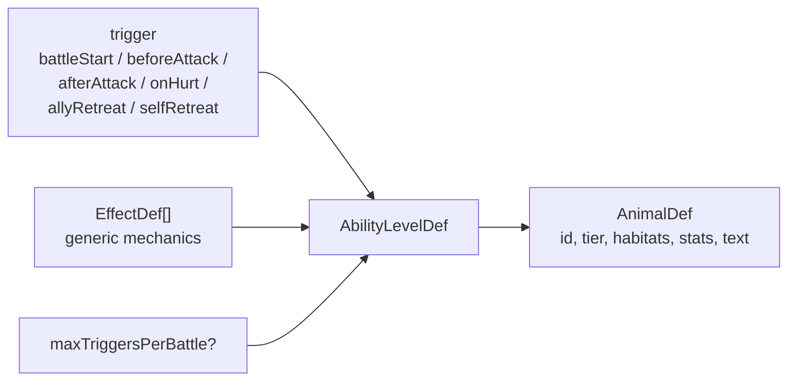

# Animal Skill Content Notes

This file documents how `animals.ts` should use the battle DSL. The goal is to
keep animal content data-driven while allowing new animals and mechanics to be
added without species-specific engine branches.

## Content Rule

Animal abilities are assembled from:

- one `trigger`
- one or more generic `effects`
- optional `maxTriggersPerBattle`
- level-scaled numbers stored in content data

Do not add `if speciesId === ...` in `battleEngine.ts` or UI code to make an
animal work. If an animal cannot be expressed, design a generic effect or target
selector first, test it in the engine, then reference it from `animals.ts`.

## Current Animal Mapping

| Animal | Trigger | Generic effect composition |
| --- | --- | --- |
| Hedgehog | `onHurt` | `dealDamage(attacker)` |
| Frog | `afterAttack` | `swapSelfWithNearestAlly(behind)` plus swapped ally attack buff |
| Mussel | `onHurt` | `gainShield(self)` |
| Swallow | `battleStart` | `gainShield(allyFront)` |
| Otter | `battleStart` | `modifyAttack(allyAheadSelf)` and `modifyHealth(allyAheadSelf)` |
| Hare | `beforeAttack` | `modifyAttack(self)` |
| Kingfisher | `battleStart` | `dealDamage(enemyBack)` |
| Carp | `selfRetreat` | `modifyAttack(allyFront)` and `modifyHealth(allyFront)` |
| Crow | `allyRetreat` | `modifyAttack(self)` without a trigger cap |
| Pangolin | `selfRetreat` | `gainShield(allyFront)` |
| Egret | `beforeAttack` | `dealDamage(enemyLowestHealth)` |
| Weasel | `afterAttack` | `reduceAttack(enemyFront)` |
| Crucian carp | `selfRetreat` | `summonUnit(swallow, sourceThenBack)` |
| Red-bellied squirrel | `battleStart` | `modifyAttack(randomAlly)` |
| Yellow weasel | `afterAttack` | `reduceAttack(enemyFront)` and `pushTarget(enemyFront)` |
| Common kingfisher | `battleStart` | `dealDamage(enemyBack)` |
| Spot-billed duck | `battleStart` | `gainShield(allyFront)` |
| Mandarin duck | `battleStart` | `modifyAttack(allAllies)` |
| Night heron | `beforeAttack` | `dealDamage(enemyBack)` |
| Chinese water deer | `afterAttack` | `pushTarget(enemyFront)` and `modifyHealth(self)` |
| Cabot's tragopan | `battleStart` | `modifyHealth(allAllies)` |
| Chinese alligator | `onHurt` | `dealDamageAndGainOnRetreat(attacker)` |
| Sparrow | `allyRetreat` | `gainShield(self)` |
| White-headed bulbul | `battleStart` | `modifyAttack(allyBack)` and `modifyHealth(allyBack)` |
| Black muntjac | `beforeAttack` | `swapSelfWithNearestAlly(behind)`, then `gainShield(allyAheadSelf)` |

## Naming Guidance

Use mechanic names that can serve multiple animals:

- Good: `swapSelfWithNearestAlly`, `pushTarget`, `summonUnit`,
  `dealDamageAndGainOnRetreat`.
- Risky: `moveSelf` because it does not say whether the unit swaps, jumps to an
  empty slot, compacts, or drags allies.
- Risky: flavor names like `frogJump` or `alligatorDevour` because they force
  future animals to reuse the wrong flavor or add species branches.

## Movement Content

Movement content must be explicit about shape:

- Swap with nearest ally: `swapSelfWithNearestAlly`.
- Move an enemy backward: `pushTarget`.
- Move an enemy forward: `pullTarget`.
- Future movement variants should get new effect kinds rather than overloading
  existing ones.

Movement effects are interpreted symmetrically for player and opponent. They
operate on current combat side, not original owner, unless a future mechanic
explicitly says otherwise.

## Summon Content

Summoned units are battle-only units:

- id format: `summon_${originOwner}_${sourceUnitId}_${sequence}`
- they keep `originOwner` from the summoner
- they fight like normal battle units after entering
- they use `BoardMutationService.firstEmptySlot` to avoid duplicate active slots
- `sourceThenBack` tries the retreat source's slot first, then farther back

Summons should not reuse camp member ids and should not mutate camp state.

## Review Checklist For New Animals

- The animal is expressible as data in `animals.ts`.
- Numbers and text live in content data.
- Engine tests cover any new effect before the animal references it.
- Player and opponent paths are both covered for mechanics that target either
  side.
- Movement/summon/retreat interactions preserve unique active slots.
- Content validation knows how to reject malformed effect data.
