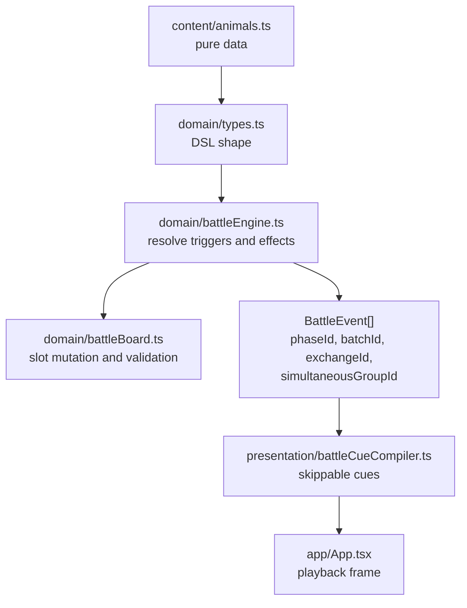

# Battle Mechanics Notes

This file is for future Codex passes. Keep it close to `battleEngine.ts`,
`battleBoard.ts`, and `types.ts` because it documents domain-level contracts,
not UI timing or art.

## Core Boundaries

- `types.ts` defines the battle DSL: triggers, target selectors, effects,
  statuses, slots, units, and events.
- `battleEngine.ts` interprets content data. It may branch on `effect.kind`,
  `trigger`, selector, status kind, and event phase. It must not branch on
  `speciesId` for animal abilities.
- `battleBoard.ts` is the single owner of battle slot mutation. Any movement,
  swap, push, pull, compaction, or empty-slot lookup should pass through
  `BoardMutationService`.
- Presentation timing belongs to `src/presentation`, not the domain. Domain
  events carry ordering and grouping metadata only.

## Slot Model

Slots are global fixed slots: `L4..L0 | R0..R4`.

- `originOwner` records who brought or summoned the unit.
- `side` is derived from the current slot via `combatSideForSlot`.
- `position` is a compatibility number derived from the slot number.
- Same-side production movement must not create duplicate active occupancy.
- Cross-side movement remains disabled unless an explicit sandbox flag enables
  it.

Movement events are emitted per moved unit, but a contiguous group with the same
`metadata.causeUnitId` represents one atomic board mutation. Consumers that
replay position should apply the whole group before checking occupancy.

## Effect Semantics

Effect kinds should be named by generic mechanics, not by animal flavor.

| Effect kind | Generic contract | Current content examples |
| --- | --- | --- |
| `dealDamage` | Deal ability damage through the shared damage pipeline. | Hedgehog counter, kingfisher dive |
| `modifyAttack` | Add attack to selected target(s). Negative attack changes should use `reduceAttack`. | Hare charge, crow ally-retreat growth |
| `modifyHealth` | Add max health and current health to target(s). | Otter, carp, tragopan |
| `gainShield` | Add shield to target(s). | Mussel, swallow, pangolin |
| `reduceAttack` | Clamp target attack down by amount and record contribution. | Weasel, yellow weasel |
| `swapSelfWithNearestAlly` | Swap source with nearest ally in `ahead` or `behind` direction; optional attack buff to swapped ally. | Frog |
| `pushTarget` | Move selected target backward within its current combat side through `BoardMutationService`. | Yellow weasel, water deer |
| `pullTarget` | Move selected target forward within its current combat side through `BoardMutationService`. | Reserved for future content |
| `summonUnit` | Create a battle-only unit with generated id and a board-validated empty slot. | Crucian carp |
| `dealDamageAndGainOnRetreat` | Deal damage and grant source stats only if that damage knocks the target out. | Chinese alligator |
| `applyBattleStatus` | Attach a battle status to selected target(s). | Reserved for future status animals |

Avoid effect names like `frogJump`, `devourTarget`, or `moveSelf` unless the
name describes a broad reusable mechanic. If a future animal needs a different
self-movement shape, add a separate explicit effect such as
`moveSelfToEmptySlot`, `swapSelfWithTarget`, or `moveTargetToExtreme`.

## Event Ordering

The resolver uses snapshot/resolve phases:

1. `environment`
2. `battleStart`
3. `exchangeStart`
4. `preAttack`
5. `impact`
6. `hurt` and `retreat` waves
7. `afterAttack`
8. `battleEnd`

Rules that must remain stable:

- Battle start and pre-attack triggers are collected from snapshots.
- Committed triggers survive same-batch opposing damage.
- Attackers are locked at exchange start.
- Normal attack damage for a pair shares one `simultaneousGroupId`.
- A unit removed before impact does not get replaced for that exchange.
- Skill damage can trigger `onHurt`, but only a surviving target may react.
- `selfRetreat` effects are allowed to resolve from the unit that just retreated.

## Invariant Checklist

When adding a new mechanic:

- Add a generic `EffectDef` or selector only if existing kinds cannot express it.
- Implement engine behavior by `effect.kind`, not `speciesId`.
- Route slot changes through `BoardMutationService`.
- Emit domain events without milliseconds or presentation duration.
- Include `metadata.effect` on effect-originated events when useful for debug.
- Add tests for player and opponent symmetry when the effect can occur on both
  sides.
- Add a regression test if movement, summon, retreat, or damage chains interact.
